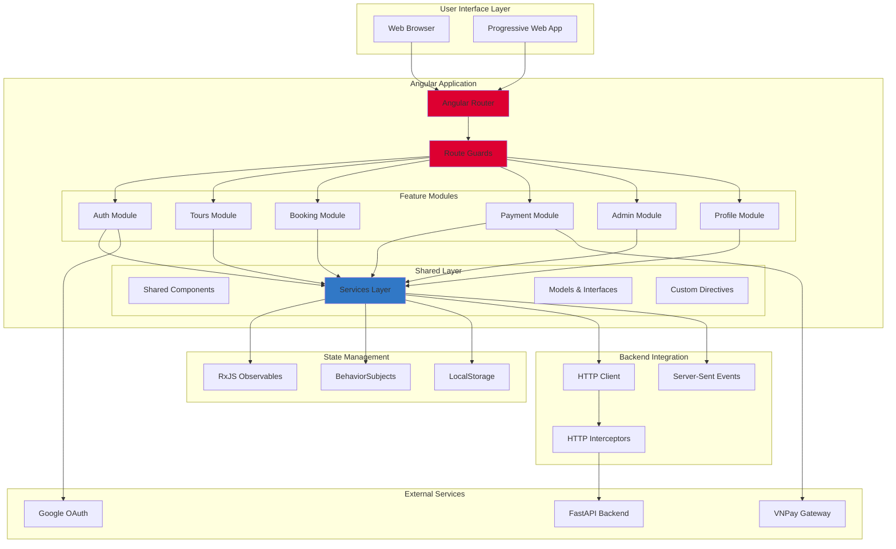
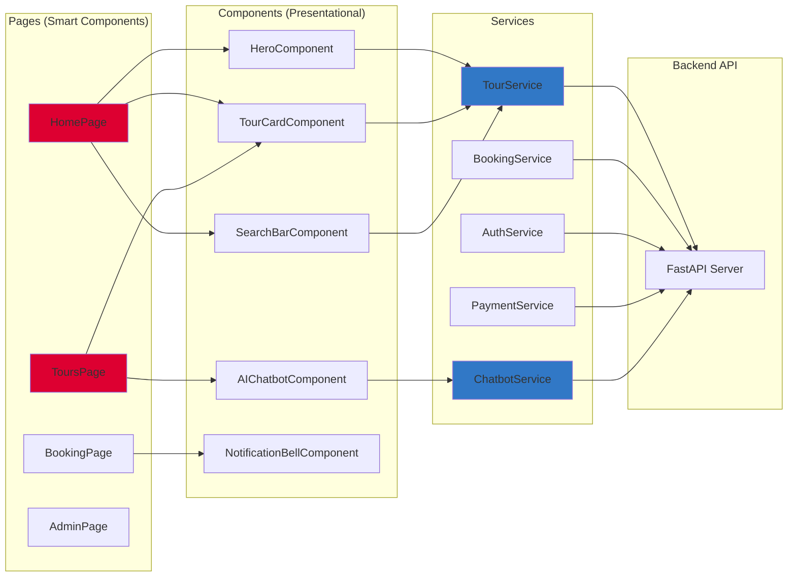
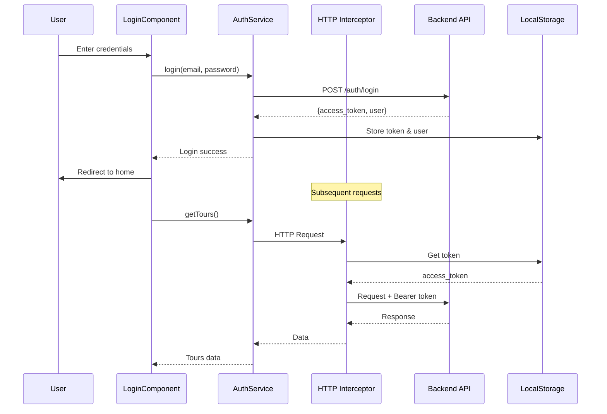
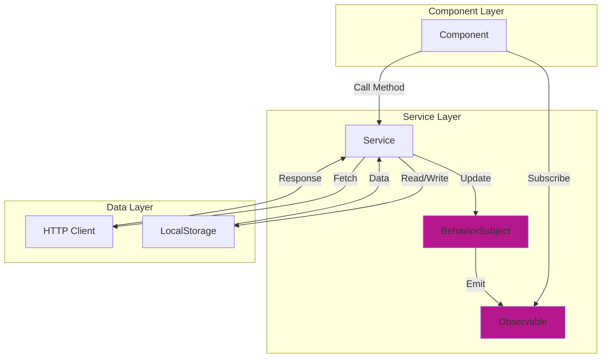

<p align="center">
  
  
  
  
  
</p>

<h1 align="center">🌍 AI Tour Booking System - Frontend</h1>

<p align="center">
  <strong>Modern Angular SPA với AI Chatbot, Real-time Notifications và Responsive Design</strong>
</p>

<p align="center">
  <a href="#-tính-năng">Tính năng</a> •
  <a href="#-system-architecture">Architecture</a> •
  <a href="#-tech-stack">Tech Stack</a> •
  <a href="#-cài-đặt">Cài đặt</a> •
  <a href="#-project-structure">Structure</a>
</p>

---

## ✨ Tính năng

### 🔐 Authentication & User Management
- Đăng nhập/Đăng ký với Email & Password
- Google OAuth 2.0 Integration
- JWT Token Management với Auto-refresh
- Role-based Access Control (Admin/User)
- User Profile Management

### 🎫 Tour & Booking Features
- **Tour Search**: Tìm kiếm với filters (destination, price, date)
- **AI-Powered Search**: Semantic search với natural language
- **Tour Details**: Gallery, itinerary, reviews, ratings
- **Booking Flow**: Multi-step booking với OTP verification
- **My Bookings**: Quản lý booking history với status tracking

### 💳 Payment Integration
- VNPay Payment Gateway
- Payment History & Receipts
- Promotion/Voucher Application
- Real-time Payment Status Updates

### 🤖 AI Features
- **AI Chatbot**: Streaming responses với SSE
- **Admin AI Assistant**: AI hỗ trợ quản trị viên
- **Smart Recommendations**: AI-powered tour suggestions
- **Natural Language Search**: Tìm kiếm bằng ngôn ngữ tự nhiên

### 👨‍💼 Admin Dashboard
- Tour Package Management (CRUD)
- Booking Management
- User Management
- Payment Reports & Analytics
- Promotion Management
- Featured Tours Configuration

### 🔔 Real-time Features
- Push Notifications
- Real-time Booking Updates
- Live Chat với AI
- Payment Status Notifications

### 📱 Responsive Design
- Mobile-first approach
- Tablet & Desktop optimized
- Touch-friendly UI
- Progressive Web App ready

---

## 🏗 System Architecture

### High-Level Architecture



### Component Architecture



### Authentication Flow



### State Management Pattern



### Routing Architecture

```
/
├── auth/
│   ├── login
│   ├── register
│   └── google-callback
├── home
├── tours/
│   ├── :id (tour details)
│   └── search
├── booking/
│   ├── :tourId (booking form)
│   └── confirmation
├── my-bookings
├── my-payments
├── profile
├── promotions
├── travel-news
└── admin/ (Protected)
    ├── dashboard
    ├── tours
    ├── bookings
    ├── users
    ├── payments
    └── promotions
```

---

## 🛠 Tech Stack

| Category | Technologies |
|----------|-------------|
| **Framework** | Angular 19.0 |
| **Language** | TypeScript 5.6 |
| **UI Library** | PrimeNG 19.0 |
| **Styling** | TailwindCSS 3.4, SCSS |
| **State Management** | RxJS 7.8, BehaviorSubjects |
| **HTTP Client** | Angular HttpClient |
| **Routing** | Angular Router with Guards |
| **Forms** | Reactive Forms |
| **Animations** | Angular Animations |
| **3D Graphics** | Three.js 0.181 |
| **Carousel** | ngx-owl-carousel-o |
| **Testing** | Jasmine, Karma |
| **Build Tool** | Angular CLI 19.0 |
| **Package Manager** | npm |

---

## 📁 Project Structure

```
SE347_IE104_Frontend/
├── src/
│   ├── app/
│   │   ├── pages/                  # Smart Components (Container)
│   │   │   ├── auth/
│   │   │   │   ├── login/
│   │   │   │   ├── register/
│   │   │   │   └── google-callback/
│   │   │   ├── home/
│   │   │   ├── tours/
│   │   │   ├── booking-pages/
│   │   │   ├── my-bookings/
│   │   │   ├── my-payments/
│   │   │   ├── payment/
│   │   │   ├── profile/
│   │   │   ├── promotions/
│   │   │   ├── reviews/
│   │   │   ├── travel-news/
│   │   │   └── admin/              # Admin Dashboard
│   │   │       ├── dashboard/
│   │   │       ├── tours/
│   │   │       ├── bookings/
│   │   │       ├── users/
│   │   │       ├── payments/
│   │   │       └── promotions/
│   │   │
│   │   ├── components/             # Presentational Components
│   │   │   ├── hero/
│   │   │   ├── search-bar/
│   │   │   ├── tour-card/
│   │   │   ├── booking-card/
│   │   │   ├── ai-chatbot/
│   │   │   ├── admin-chatbot/
│   │   │   ├── notification-bell/
│   │   │   ├── payment-method/
│   │   │   ├── promotion-banner/
│   │   │   ├── travel-news-card/
│   │   │   └── ...
│   │   │
│   │   ├── services/               # Business Logic
│   │   │   ├── auth.service.ts
│   │   │   ├── auth-state.service.ts
│   │   │   ├── tour.service.ts
│   │   │   ├── booking.service.ts
│   │   │   ├── payment.service.ts
│   │   │   ├── chatbot.service.ts
│   │   │   ├── notification.service.ts
│   │   │   ├── profile.service.ts
│   │   │   ├── review.service.ts
│   │   │   ├── promotion.service.ts
│   │   │   ├── config.service.ts
│   │   │   └── admin/
│   │   │       ├── admin-tour.service.ts
│   │   │       ├── admin-booking.service.ts
│   │   │       └── admin-user.service.ts
│   │   │
│   │   ├── guards/                 # Route Guards
│   │   │   ├── auth.guard.ts
│   │   │   └── admin.guard.ts
│   │   │
│   │   ├── layouts/                # Layout Components
│   │   │   ├── header/
│   │   │   ├── footer/
│   │   │   └── admin-layout/
│   │   │
│   │   ├── shared/                 # Shared Resources
│   │   │   ├── models/
│   │   │   │   ├── tour.model.ts
│   │   │   │   ├── booking.model.ts
│   │   │   │   ├── user.model.ts
│   │   │   │   └── payment.model.ts
│   │   │   ├── interceptors/
│   │   │   │   └── auth.interceptor.ts
│   │   │   └── utils/
│   │   │
│   │   ├── directives/             # Custom Directives
│   │   │
│   │   ├── app.component.ts        # Root Component
│   │   ├── app.config.ts           # App Configuration
│   │   └── app.routes.ts           # Route Configuration
│   │
│   ├── assets/                     # Static Assets
│   │   ├── images/
│   │   ├── icons/
│   │   └── fonts/
│   │
│   ├── styles/                     # Global Styles
│   │   └── styles.scss
│   │
│   └── environments/               # Environment Config
│       ├── environment.ts
│       └── environment.prod.ts
│
├── public/                         # Public Assets
├── angular.json                    # Angular CLI Config
├── package.json                    # Dependencies
├── tailwind.config.js              # TailwindCSS Config
├── tsconfig.json                   # TypeScript Config
├── Dockerfile                      # Docker Config
└── nginx.conf                      # Nginx Config
```

---

## 🚀 Cài đặt

### Prerequisites

- Node.js 18+ và npm
- Angular CLI 19.0+

### 1. Install Angular CLI

```bash
npm install -g @angular/cli@19
```

### 2. Install Dependencies

```bash
npm install
```

### 3. Configure Environment

Tạo file `src/environments/environment.ts`:

```typescript
export const environment = {
  production: false,
  apiUrl: 'http://localhost:8000/api/v1',
  googleClientId: 'your_google_client_id'
};
```

### 4. Run Development Server

```bash
ng serve
```

Ứng dụng sẽ chạy tại: `http://localhost:4200`

---

## ▶️ Available Scripts

### Development

```bash
# Start dev server
ng serve

# Start with specific port
ng serve --port 4300

# Open browser automatically
ng serve --open
```

### Build

```bash
# Development build
ng build

# Production build
ng build --configuration production

# Build with stats
ng build --stats-json
```

### Testing

```bash
# Run unit tests
ng test

# Run tests with coverage
ng test --code-coverage

# Run tests in headless mode
ng test --browsers=ChromeHeadless --watch=false
```

### Code Quality

```bash
# Lint code
ng lint

# Format code
npm run format
```

---

## 🐳 Docker Deployment

### Build Docker Image

```bash
docker build -t tour-booking-frontend .
```

### Run Container

```bash
docker run -p 80:80 tour-booking-frontend
```

### Docker Compose

```bash
docker-compose up -d
```

---

## 📦 Key Features Implementation

### 1. AI Chatbot with SSE

```typescript
// chatbot.service.ts
streamChat(message: string): Observable<string> {
  const eventSource = new EventSource(
    `${this.apiUrl}/chat/stream?message=${message}`
  );
  
  return new Observable(observer => {
    eventSource.onmessage = (event) => {
      observer.next(event.data);
    };
    
    eventSource.onerror = () => {
      observer.error('Connection error');
      eventSource.close();
    };
  });
}
```

### 2. JWT Authentication Interceptor

```typescript
// auth.interceptor.ts
intercept(req: HttpRequest<any>, next: HttpHandler) {
  const token = this.authService.getToken();
  
  if (token) {
    req = req.clone({
      setHeaders: {
        Authorization: `Bearer ${token}`
      }
    });
  }
  
  return next.handle(req);
}
```

### 3. Route Guards

```typescript
// auth.guard.ts
canActivate(): boolean {
  if (this.authService.isAuthenticated()) {
    return true;
  }
  
  this.router.navigate(['/auth/login']);
  return false;
}
```

### 4. Reactive Forms with Validation

```typescript
// booking.component.ts
bookingForm = this.fb.group({
  numberOfPeople: [1, [Validators.required, Validators.min(1)]],
  contactName: ['', Validators.required],
  contactPhone: ['', [Validators.required, Validators.pattern(/^[0-9]{10}$/)]],
  specialRequests: ['']
});
```

---

## 🎨 UI/UX Features

- **Responsive Design**: Mobile-first với breakpoints cho tablet & desktop
- **Dark Mode Ready**: Theme switching support
- **Smooth Animations**: Angular Animations cho transitions
- **Loading States**: Skeleton loaders và spinners
- **Error Handling**: User-friendly error messages
- **Toast Notifications**: Real-time feedback với PrimeNG Toast
- **Accessibility**: ARIA labels và keyboard navigation

---

## 🔒 Security Features

- **XSS Protection**: Angular's built-in sanitization
- **CSRF Protection**: Token-based authentication
- **Route Guards**: Protected routes cho admin
- **Input Validation**: Client-side validation với Reactive Forms
- **Secure Storage**: Encrypted token storage

---

## 📊 Performance Optimization

- **Lazy Loading**: Feature modules loaded on demand
- **OnPush Change Detection**: Optimized rendering
- **TrackBy Functions**: Efficient ngFor rendering
- **Image Optimization**: Lazy loading images
- **Bundle Optimization**: Tree-shaking và code splitting

---

## 📄 License

MIT License © 2024

---

<p align="center">
  Made with ❤️ by SE347 Team
</p>
